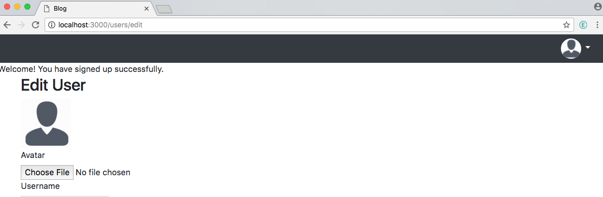
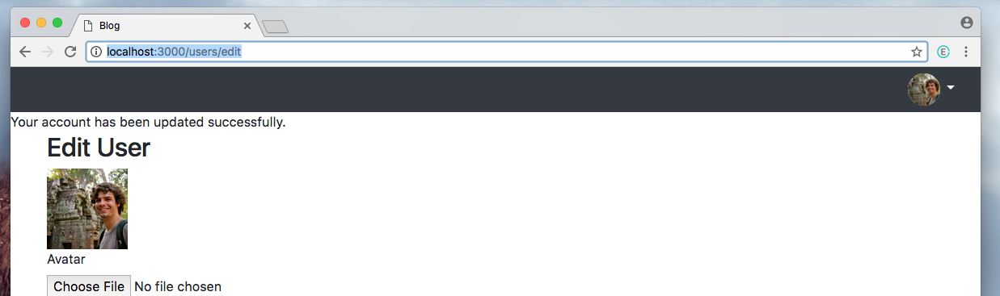
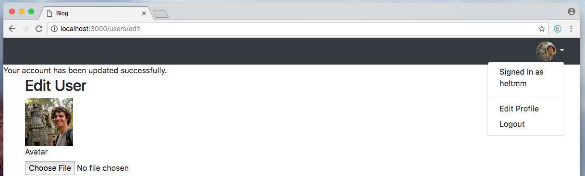

# Dropdown NavBar Template

## This the finished template created by along with my blog post [Creating a Dropdown Navbar With Users and Avatars](https://heltmm.github.io/jekyll/update/2017/12/06/create_a_user_avatar_dropdown_nabar.html)

